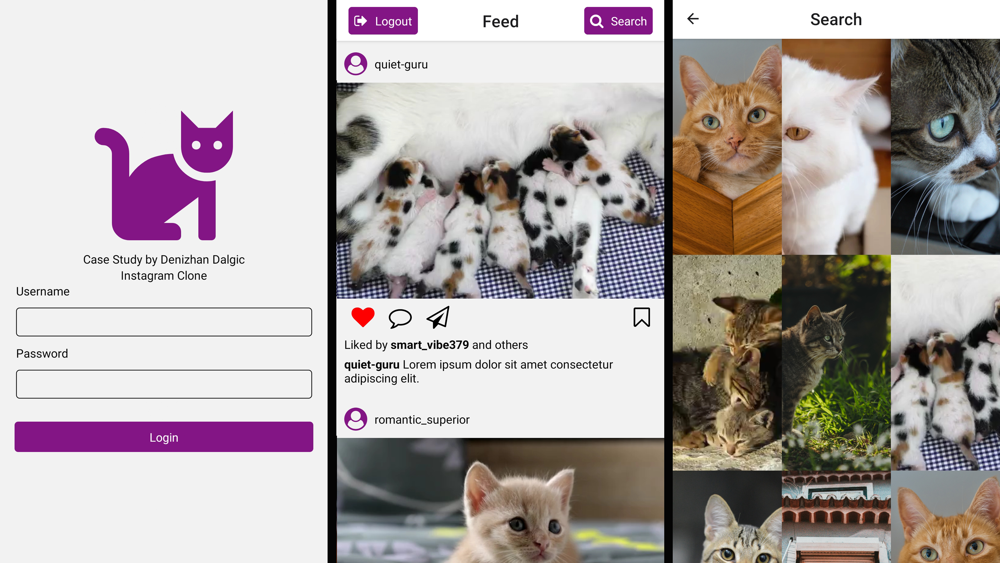

# Instagram Clone

## Usage
- Login with your username and password.
- Explore your feed full of cats. Posts can be swipable images or a video.
- Tap on search to see suggested posts shown in a grid.

## Tech Stack and Features
- Media loads without blocking the main/UI thread.
- Adaptable to different screen sizes and resolutions.
- Login information is saved to Android's EncryptedSharedPreferences and iOS' Keychain through [react-native-encrypted-storage](https://github.com/emeraldsanto/react-native-encrypted-storage).
- Based on custom components.
- Uses React Hooks.
- Post content is received from mock API created with MirageJS.
- Checks network connection with NetInfo
- ESLint standardized code.
